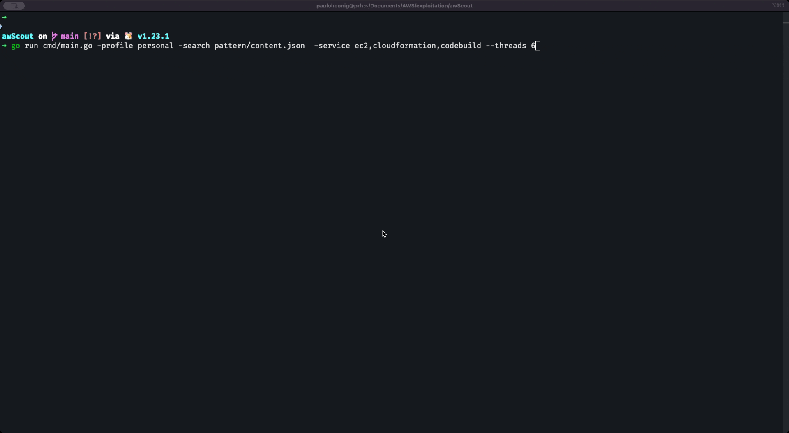

# awScout
Security-focused tool that scans multiple AWS services for exposed secrets and sensitive data using regex-based detection

This repository helps developers and security teams identify credentials, tokens, and other confidential information stored across multiple AWS services.

### Supported Services
- EC2
    * User Data
    * Launch Templates with versioning
- CloudFormation
    * Stack
    * StackSets
    * Parameters
- Lambda
    * Code with versioning
    * Environment variables
- Glue
    * Jobs
    * Scripts stored in S3
- Codebuild
    * Source/Buildspec
    * Environment Variables
- Sagemaker
    * Jobs
- EMR
    * Bootstrap actions
    * Scripts

### How-to use
1. Ensure GO is installed
2. `git clone https://github.com/pahennig/awScout.git`
3. `cd awScout`
5. Choose the supported services (ec2, cloudformation, lambda, glue, codebuild, sagemaker, emr) and run like the example below
4. `go run cmd/main.go -profile $aws-profile -search pattern/findallstring.json  -service ec2,cloudformation --show`

### Example
With and without offuscation
